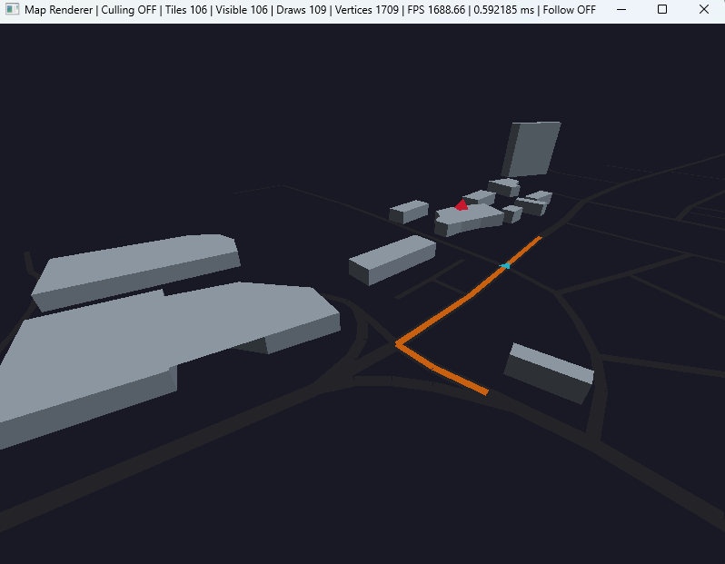
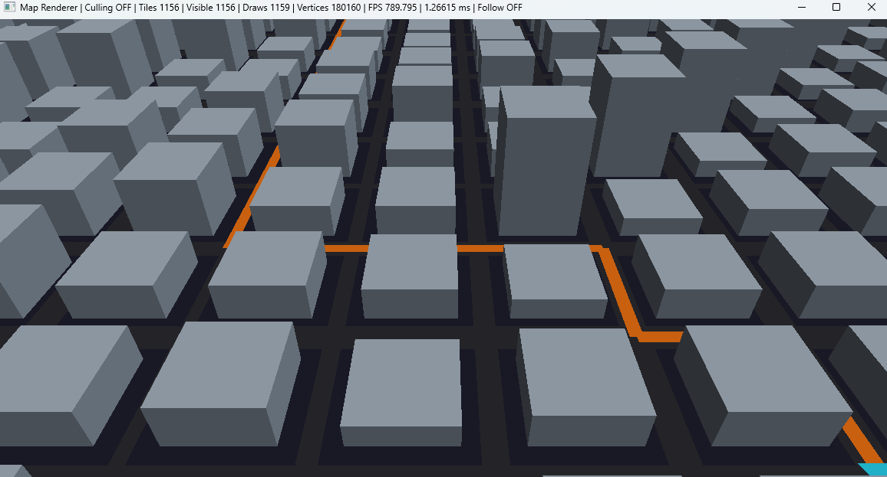
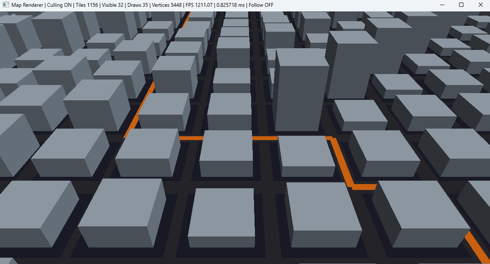

# C++ OpenGL Mini Map Renderer

GeoJSON 공간 데이터를 파싱하여 건물과 도로를 3D로 시각화하는 C++ / OpenGL 기반 미니 지도 렌더러입니다.

실제 OpenStreetMap(OSM) 데이터를 사용해 건물 `Polygon`과 도로 `LineString`을 Mesh로 변환하고, Tile 기반 공간 분할과 Frustum Culling을 적용했습니다.

도로 데이터를 그래프로 구성하여 Dijkstra 기반 경로 탐색, 목적지 선택, Route 시각화 및 차량 이동도 구현했습니다.

---

## Demo

### OpenStreetMap GeoJSON



### Frustum Culling OFF



### Frustum Culling ON



---

## Features

- GeoJSON `Polygon` / `LineString` 파싱
- 위경도 → 로컬 meter 좌표 변환
- 3D Building Extrusion / Road Mesh 생성
- OpenGL VAO / VBO / EBO 기반 렌더링
- Vertex / Fragment Shader 및 간단한 Directional Lighting
- Tile 기반 공간 분할
- AABB 기반 View Frustum Culling
- Dijkstra 기반 Route Planning
- 건물 클릭을 통한 목적지 변경 및 경로 재탐색
- Route / 목적지 / 차량 시각화
- Vehicle Follow Camera
- OSM 건물 높이 / 도로 폭 fallback 처리
- Draw Call / Visible Tile / Vertex / Frame Time 측정

---

## Architecture

```text
GeoJSON
   ↓
GeoJsonLoader
   ↓
BuildingData / RoadData
   ↓
Geometry
   ↓
TileManager
   ↓
MapTile + AABB
   ↓
Frustum Culling
   ↓
Renderer
   ↓
OpenGL